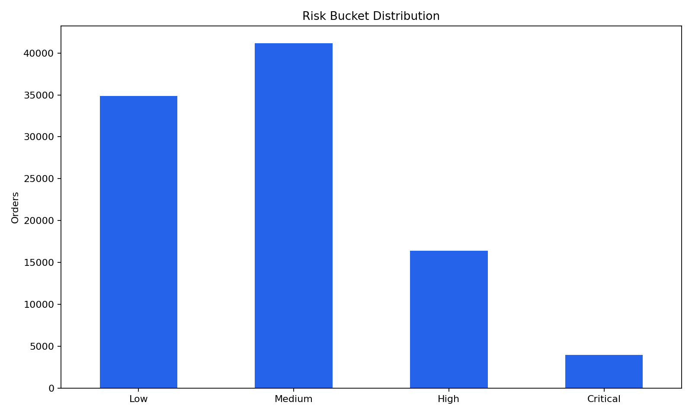
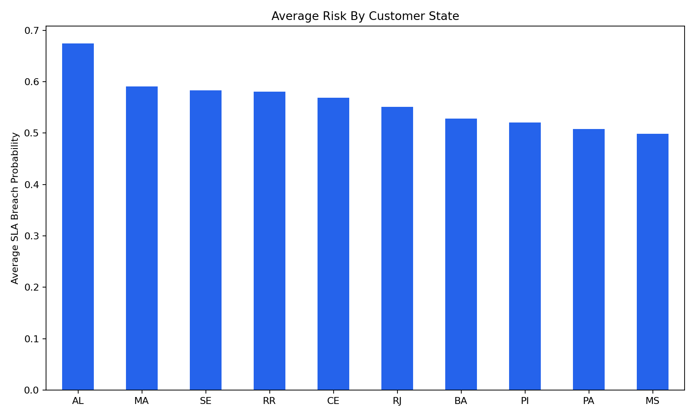
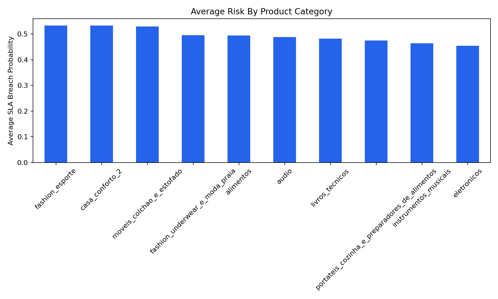

# DeliverIQ SLA Breach Prediction

DeliverIQ is an end-to-end machine learning project that predicts whether an e-commerce order is likely to breach its promised delivery SLA. The system uses historical order, customer, seller, product, freight, and delivery timeline data to generate SLA breach probabilities and risk buckets. The final output helps logistics and operations teams identify high-risk deliveries early and prioritize intervention.

## Business Problem

Late deliveries create customer dissatisfaction, support workload, and operational cost. Logistics teams need an early warning system that identifies orders at risk of missing the promised delivery date before the delay happens.

## ML Problem Statement

This project frames SLA breach prediction as a binary classification problem:

- `0`: order is expected to meet the promised delivery SLA
- `1`: order is at risk of breaching the promised delivery SLA

The model prioritizes recall for the breach class because missing a delayed order is more costly than reviewing extra alerts.

## Dataset

The project uses the Brazilian Olist e-commerce dataset, including:

- orders and delivery timestamps
- customers and sellers
- order items
- products
- freight and commercial values
- location fields

The final model dataset is `data/processed/feature_dataset.csv`, with one row per order and model-safe pre-delivery features.

## Target Variable

The target column is `sla_breached`.

An order is marked as breached when the customer delivery date is later than the estimated delivery date. Post-delivery fields used to create the target are excluded from model inputs to avoid leakage.

## Repository Structure

```text
config.yaml
data/
  raw/                 Raw source datasets
  silver/              Cleaned source-level datasets
  processed/           Modeling and feature datasets
  predictions/         Final risk score output
  gold/                Final analytical consumption dataset
docs/                  Project notes, validation, and presentation docs
models/                Trained model artifacts
notebooks/             Day-by-day exploratory and modeling notebooks
reports/               Data, modeling, explainability, and final reports
src/
  data/                Data loading and cleaning scripts
  features/            Feature engineering pipeline
  models/              Training, model selection, and prediction scripts
  explainability/      Model explanation utilities
dashboard/             Streamlit dashboard
```

## Project Workflow

```text
Raw Olist Dataset
        |
Data Cleaning
        |
SLA Breach Target Creation
        |
Feature Engineering
        |
Baseline Modeling
        |
Advanced Modeling
        |
Model Selection
        |
Risk Scoring
        |
Explainability
        |
Dashboard
```

## Feature Engineering Summary

The final feature set uses only information available before customer delivery, including:

- purchase timing features
- estimated delivery duration
- customer and seller location features
- seller-customer route features
- product category, weight, and volume features
- order value, freight, item-count, and intensity features
- bucketed delivery, price, freight, and count features

Leakage fields such as actual delivery date, delivery delay, order status after fulfillment, IDs, and review fields are excluded from model inputs.

## Models Trained

Baseline models:

- Logistic Regression
- Decision Tree
- Random Forest

Advanced sklearn models:

- Optimized Logistic Regression
- Tuned Random Forest
- HistGradientBoosting

LightGBM and XGBoost were listed as candidate advanced models, but they are not included in the current dependency set. The implemented advanced workflow uses sklearn-only models for reproducibility.

## Evaluation Metrics

The project focuses on imbalanced binary classification metrics:

- recall for class `1`
- precision for class `1`
- F1-score for class `1`
- PR-AUC
- ROC-AUC
- confusion matrix

Accuracy is reported but is not used as the primary selection criterion.

## Final Model Selected

The final selected model is `Logistic Regression` with a tuned operating threshold of `0.25`.

On the held-out test set at the selected threshold:

| Metric | Value |
| --- | ---: |
| Recall class 1 | 0.8914 |
| Precision class 1 | 0.1005 |
| F1 class 1 | 0.1806 |
| PR-AUC | 0.1825 |
| False negatives | 170 |
| False positives | 12,488 |

The model was selected because the project prioritizes catching SLA breaches early, even if that creates additional false alerts for operations review.

## Risk Bucket Logic

| Probability Range | Risk Bucket | Action |
| ---: | --- | --- |
| 0.00-0.30 | Low | No action |
| >0.30-0.60 | Medium | Monitor |
| >0.60-0.80 | High | Prioritize |
| >0.80-1.00 | Critical | Immediate intervention |

## Dashboard Overview

The Streamlit dashboard shows:

- total orders scored
- actual SLA breach rate
- Low, Medium, High, and Critical risk order counts
- high-risk order table
- SLA breach probability distribution
- risk by customer state
- risk by seller state
- risk by product category
- filters for customer state, seller state, category, and risk bucket

Dashboard chart screenshots:







## How To Run

Install dependencies:

```bash
pip install -r requirements.txt
```

Build the feature dataset:

```bash
python -m src.features.build_features
```

Train the Day 4 baseline models:

```bash
python -m src.models.train_baseline
```

Train advanced models and save the final model:

```bash
python -m src.models.train_model
```

Generate risk scores:

```bash
python -m src.models.predict
```

Generate explainability outputs:

```bash
python -m src.explainability.shap_analysis
```

Run the dashboard:

```bash
python -m streamlit run dashboard/app.py
```

## Results Summary

The final risk scoring workflow generated predictions for 96,470 orders:

| Risk Bucket | Orders |
| --- | ---: |
| Low | 34,891 |
| Medium | 41,184 |
| High | 16,412 |
| Critical | 3,983 |

The dashboard and prediction CSV make model output usable for business review, not just technical evaluation.

## Key Learnings

- SLA breach prediction is an imbalanced classification problem.
- Recall and PR-AUC are more useful than accuracy for this use case.
- Threshold tuning materially changes operational usefulness.
- Geographic and route-related signals are important drivers of delivery risk.
- A deployable ML project needs risk scoring, explanation, and dashboard output, not just a trained model.

## Future Improvements

- Add probability calibration for clearer risk interpretation.
- Test LightGBM, XGBoost, or CatBoost if dependency changes are allowed.
- Add SHAP as an optional dependency for deeper local explanations.
- Validate risk thresholds with operations capacity and false-alert tolerance.
- Add automated tests for feature leakage, prediction output shape, and dashboard data loading.
